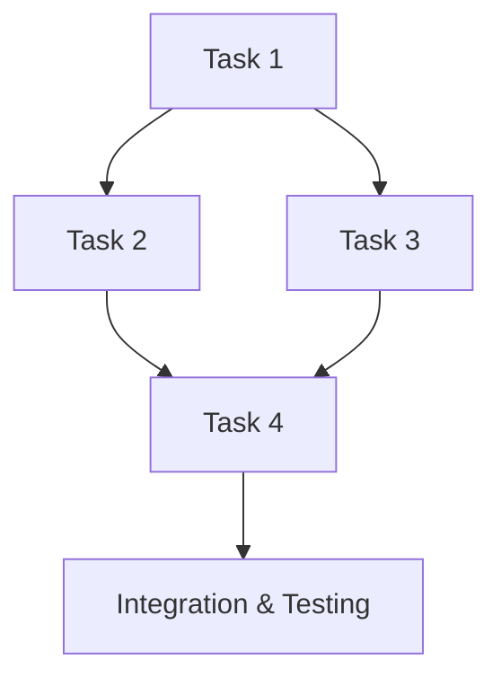

# Implementation Plan

## Overview
- **Story**: [STORY_ID] - [STORY_TITLE]
- **Tech Lead**: [TECH_LEAD_NAME]
- **Developer(s)**: [DEVELOPER_NAMES]
- **Plan Date**: [PLAN_CREATION_DATE]
- **Target Completion**: [TARGET_COMPLETION_DATE]

## Business Context Summary
- **User Value**: [BRIEF_USER_VALUE_SUMMARY]
- **Business Value**: [BRIEF_BUSINESS_VALUE_SUMMARY]
- **Success Criteria**: [KEY_SUCCESS_METRICS]

## Technical Approach Summary
- **Architecture Alignment**: [HOW_THIS_ALIGNS_WITH_HIGH_LEVEL_ARCHITECTURE]
- **Implementation Strategy**: [CHOSEN_TECHNICAL_APPROACH]
- **Key Technical Decisions**: [REFERENCE_TO_TECH_DECISION_RECORDS]

## Development Task Breakdown

### Task Sequence & Dependencies

### Task 1: [TASK_NAME]

#### Description
[DETAILED_DESCRIPTION_OF_WHAT_NEEDS_TO_BE_IMPLEMENTED]

#### Technical Details
- **Primary Files**: [FILES_TO_CREATE_OR_MODIFY]
- **Dependencies**: [OTHER_TASKS_OR_COMPONENTS_NEEDED_FIRST]
- **Technology/Libraries**: [SPECIFIC_TECH_STACK_ELEMENTS]
- **Design Patterns**: [PATTERNS_TO_FOLLOW]

#### Implementation Steps
1. [STEP_1] - [BRIEF_DESCRIPTION]
2. [STEP_2] - [BRIEF_DESCRIPTION]
3. [STEP_3] - [BRIEF_DESCRIPTION]
4. [STEP_4] - [BRIEF_DESCRIPTION]

#### Acceptance Criteria
- [ ] [TECHNICAL_ACCEPTANCE_CRITERION_1]
- [ ] [TECHNICAL_ACCEPTANCE_CRITERION_2]
- [ ] [TECHNICAL_ACCEPTANCE_CRITERION_3]
- [ ] [BUSINESS_ACCEPTANCE_CRITERION_FROM_STORY]

#### Testing Requirements
- **Unit Tests**: [UNIT_TESTS_TO_CREATE]
- **Integration Tests**: [INTEGRATION_TESTS_NEEDED]
- **Manual Testing**: [MANUAL_TEST_SCENARIOS]

#### Estimated Effort
- **Time Estimate**: [TIME_ESTIMATE]
- **Complexity**: [HIGH/MEDIUM/LOW]
- **Risk Level**: [HIGH/MEDIUM/LOW]

#### Implementation Notes
[ADDITIONAL_CONTEXT_TIPS_GOTCHAS_FOR_DEVELOPER]

---

### Task 2: [TASK_NAME]

#### Description
[DETAILED_DESCRIPTION_OF_WHAT_NEEDS_TO_BE_IMPLEMENTED]

#### Technical Details
- **Primary Files**: [FILES_TO_CREATE_OR_MODIFY]
- **Dependencies**: [OTHER_TASKS_OR_COMPONENTS_NEEDED_FIRST]
- **Technology/Libraries**: [SPECIFIC_TECH_STACK_ELEMENTS]
- **Design Patterns**: [PATTERNS_TO_FOLLOW]

#### Implementation Steps
1. [STEP_1] - [BRIEF_DESCRIPTION]
2. [STEP_2] - [BRIEF_DESCRIPTION]
3. [STEP_3] - [BRIEF_DESCRIPTION]
4. [STEP_4] - [BRIEF_DESCRIPTION]

#### Acceptance Criteria
- [ ] [TECHNICAL_ACCEPTANCE_CRITERION_1]
- [ ] [TECHNICAL_ACCEPTANCE_CRITERION_2]
- [ ] [TECHNICAL_ACCEPTANCE_CRITERION_3]
- [ ] [BUSINESS_ACCEPTANCE_CRITERION_FROM_STORY]

#### Testing Requirements
- **Unit Tests**: [UNIT_TESTS_TO_CREATE]
- **Integration Tests**: [INTEGRATION_TESTS_NEEDED]
- **Manual Testing**: [MANUAL_TEST_SCENARIOS]

#### Estimated Effort
- **Time Estimate**: [TIME_ESTIMATE]
- **Complexity**: [HIGH/MEDIUM/LOW]
- **Risk Level**: [HIGH/MEDIUM/LOW]

#### Implementation Notes
[ADDITIONAL_CONTEXT_TIPS_GOTCHAS_FOR_DEVELOPER]

---

### Task 3: [TASK_NAME]

#### Description
[DETAILED_DESCRIPTION_OF_WHAT_NEEDS_TO_BE_IMPLEMENTED]

#### Technical Details
- **Primary Files**: [FILES_TO_CREATE_OR_MODIFY]
- **Dependencies**: [OTHER_TASKS_OR_COMPONENTS_NEEDED_FIRST]
- **Technology/Libraries**: [SPECIFIC_TECH_STACK_ELEMENTS]
- **Design Patterns**: [PATTERNS_TO_FOLLOW]

#### Implementation Steps
1. [STEP_1] - [BRIEF_DESCRIPTION]
2. [STEP_2] - [BRIEF_DESCRIPTION]
3. [STEP_3] - [BRIEF_DESCRIPTION]
4. [STEP_4] - [BRIEF_DESCRIPTION]

#### Acceptance Criteria
- [ ] [TECHNICAL_ACCEPTANCE_CRITERION_1]
- [ ] [TECHNICAL_ACCEPTANCE_CRITERION_2]
- [ ] [TECHNICAL_ACCEPTANCE_CRITERION_3]
- [ ] [BUSINESS_ACCEPTANCE_CRITERION_FROM_STORY]

#### Testing Requirements
- **Unit Tests**: [UNIT_TESTS_TO_CREATE]
- **Integration Tests**: [INTEGRATION_TESTS_NEEDED]
- **Manual Testing**: [MANUAL_TEST_SCENARIOS]

#### Estimated Effort
- **Time Estimate**: [TIME_ESTIMATE]
- **Complexity**: [HIGH/MEDIUM/LOW]
- **Risk Level**: [HIGH/MEDIUM/LOW]

#### Implementation Notes
[ADDITIONAL_CONTEXT_TIPS_GOTCHAS_FOR_DEVELOPER]

## Integration & Testing Plan

### Integration Strategy
[HOW_ALL_TASKS_COME_TOGETHER_INTO_WORKING_FEATURE]

### End-to-End Testing
- **Test Scenarios**: [E2E_TEST_SCENARIOS_TO_VALIDATE]
- **Test Data**: [TEST_DATA_REQUIREMENTS]
- **Environment**: [TESTING_ENVIRONMENT_SETUP]

### Performance Validation
- **Performance Requirements**: [PERFORMANCE_TARGETS_FROM_STORY]
- **Testing Approach**: [HOW_TO_VALIDATE_PERFORMANCE]
- **Success Metrics**: [PERFORMANCE_SUCCESS_CRITERIA]

### Security Validation
- **Security Requirements**: [SECURITY_REQUIREMENTS_FROM_STORY]
- **Testing Approach**: [SECURITY_TESTING_STRATEGY]
- **Compliance Checks**: [COMPLIANCE_VALIDATION_NEEDED]

## Development Environment Setup

### Prerequisites
- **Development Tools**: [REQUIRED_TOOLS_AND_VERSIONS]
- **Dependencies**: [LIBRARIES_PACKAGES_TO_INSTALL]
- **Configuration**: [ENVIRONMENT_VARIABLES_CONFIG_FILES]
- **Database Setup**: [DATABASE_SCHEMA_CHANGES_OR_SETUP]

### Local Development
- **Setup Steps**: [STEP_BY_STEP_LOCAL_ENVIRONMENT_SETUP]
- **Verification**: [HOW_TO_VERIFY_SETUP_IS_CORRECT]
- **Common Issues**: [KNOWN_SETUP_PROBLEMS_AND_SOLUTIONS]

## Code Quality Standards

### Coding Standards
- **Style Guide**: [REFERENCE_TO_TEAM_CODING_STANDARDS]
- **Naming Conventions**: [SPECIFIC_NAMING_PATTERNS_TO_FOLLOW]
- **File Organization**: [HOW_TO_ORGANIZE_NEW_FILES]
- **Documentation**: [INLINE_DOCUMENTATION_REQUIREMENTS]

### Code Review Checklist
- [ ] Code follows team style guide
- [ ] All acceptance criteria are met
- [ ] Unit tests cover new functionality
- [ ] Integration tests validate feature workflow
- [ ] Documentation is updated
- [ ] Performance requirements are met
- [ ] Security requirements are addressed
- [ ] Error handling is comprehensive

## Risk Mitigation

### Technical Risks
1. **Risk**: [TECHNICAL_RISK_1]
   - **Mitigation**: [HOW_TO_MITIGATE]
   - **Contingency**: [BACKUP_PLAN_IF_MITIGATION_FAILS]

2. **Risk**: [TECHNICAL_RISK_2]
   - **Mitigation**: [HOW_TO_MITIGATE]
   - **Contingency**: [BACKUP_PLAN_IF_MITIGATION_FAILS]

### Implementation Challenges
- **Challenge**: [IMPLEMENTATION_CHALLENGE_1]
  - **Strategy**: [HOW_TO_ADDRESS]
  - **Support**: [WHO_TO_CONTACT_FOR_HELP]

## Support & Escalation

### Tech Lead Support
- **Availability**: [WHEN_TECH_LEAD_IS_AVAILABLE]
- **Communication**: [HOW_TO_REACH_TECH_LEAD]
- **Review Schedule**: [WHEN_TECH_LEAD_WILL_REVIEW_PROGRESS]

### Architecture Questions
- **Contact**: [WHO_TO_CONTACT_FOR_ARCHITECTURE_QUESTIONS]
- **Documentation**: [WHERE_TO_FIND_ARCHITECTURE_DECISIONS]

### Business Questions
- **Contact**: [WHO_TO_CONTACT_FOR_BUSINESS_CLARIFICATION]
- **Documentation**: [WHERE_TO_FIND_BUSINESS_REQUIREMENTS]

## Progress Tracking

### Daily Checkpoints
- [ ] Task 1 progress and blockers
- [ ] Task 2 progress and blockers
- [ ] Task 3 progress and blockers
- [ ] Integration progress
- [ ] Testing progress

### Weekly Milestones
- **Week 1**: [MILESTONE_1]
- **Week 2**: [MILESTONE_2]
- **Week 3**: [MILESTONE_3]

### Success Indicators
- [ ] All tasks completed with acceptance criteria met
- [ ] Integration testing passes
- [ ] Performance requirements met
- [ ] Business stakeholder acceptance
- [ ] Code review approval
- [ ] Documentation updated

## Completion Checklist

### Technical Completion
- [ ] All development tasks completed
- [ ] Unit tests passing
- [ ] Integration tests passing
- [ ] Performance validation complete
- [ ] Security validation complete
- [ ] Code review approved

### Business Completion
- [ ] All business acceptance criteria met
- [ ] Stakeholder demo/approval
- [ ] User validation (if applicable)
- [ ] Documentation for end users updated

### Operational Completion
- [ ] Deployment scripts updated
- [ ] Monitoring/alerting configured
- [ ] Rollback procedures documented
- [ ] Team knowledge transfer complete

## Retrospective Notes

### What Worked Well
[POSITIVE_ASPECTS_OF_THE_IMPLEMENTATION_PROCESS]

### Challenges Encountered
[PROBLEMS_THAT_AROSE_AND_HOW_THEY_WERE_SOLVED]

### Lessons Learned
[KEY_LEARNINGS_FOR_FUTURE_IMPLEMENTATIONS]

### Process Improvements
[SUGGESTIONS_FOR_IMPROVING_FUTURE_IMPLEMENTATION_PLANNING]

---

*This implementation plan bridges the collaborative technical refinement into actionable development work, providing developers with clear guidance while maintaining the architectural intent and business value of the original story.*